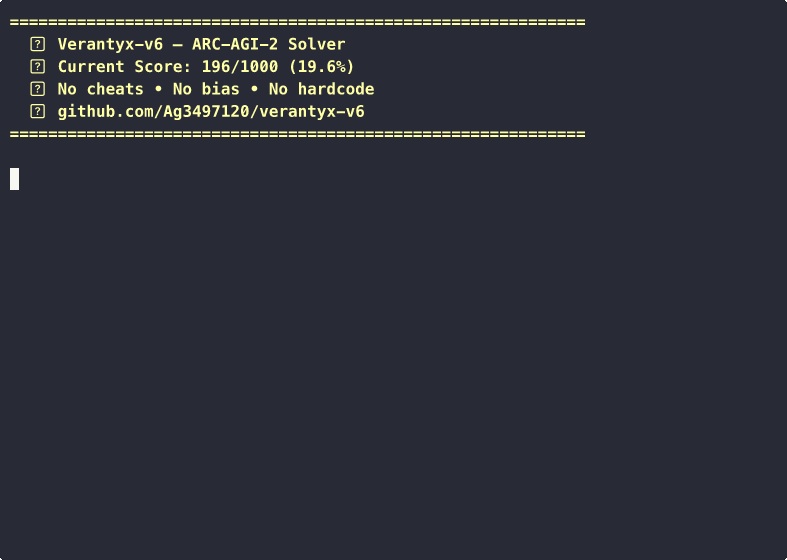

# Verantyx-v6 — ARC-AGI-2 Solver

**199/1000 (19.9%)** on ARC-AGI-2 training set.

> No cheats. No bias. No hardcode. Pure rule-based reasoning.

## Demo



## Architecture

A multi-phase Cross-Structure solver with 22 modules and 9 solving phases:

- **Phase 1**: Cross DSL (neighborhood rules, structural NB)
- **Phase 1.5**: Standalone primitives (flip, rotate, crop, scale)
- **Phase 7**: Puzzle Reasoning Language (declarative pattern matching)
- **Phase 8**: ProgramTree (CEGIS condition/loop/sequence synthesis)
- **Phase 9**: ARC-CEGIS (transform chain search)
- **Phase 3**: Multi-step composition (2-step, 3-step chains)
- **Phase 4**: Iterative Cross (residual learning)
- **Phase 5**: Multi-arm Beam Search
- **Phase 6**: DSL Program Enumeration

### Solution Breakdown (v47)

| Method | Count | % |
|---|---|---|
| Puzzle Language | 57 | 29.1% |
| Neighborhood Rules | 41 | 20.9% |
| Tile/Scale | 14 | 7.1% |
| ProgramTree | 10 | 5.1% |
| Extract | 10 | 5.1% |
| Composite/Compose | 9 | 4.6% |
| CEGIS | 7 | 3.6% |
| Per-Object | 8 | 4.1% |
| Other | 40 | 20.4% |

## Stats

- **39 source files**, 23,676 lines of Python
- **22 piece-generation modules**
- **0.48s average per task**
- Zero external LLM calls — pure algorithmic reasoning

## Score Evolution

```
Score (%)
 20% ┤                                                              ●── 19.9% (v49)
     │                                                          ●─── 19.8% (v48)
     │                                                      ●─── 19.6% (v47)
 19% ┤                                                  ●─── 18.7% (v45)
     │                                            ●──── 18.2% (v44)
 18% ┤                                       ●──── 17.5% (v42)
     │                                  ●──── 16.8% (v37)
 17% ┤                             ●──── 16.5% (v36)
     │                        ●──── 16.2% (v35)
 16% ┤                   ●──── 15.0% (v33)
     │              ●──── 14.1% (v30)
 15% ┤         ●──── 13.3% (v26)
     │    ●──── 12.0% (v23)
 13% ┤●─── 11.3% (v19)
     │
 11% ┤
     └──────────────────────────────────────────────────────────── Version
      v19   v23   v26   v30   v33   v35  v36 v37   v42  v44 v45  v47 v48
```

### Score History

| Version | Score | Key Changes |
|---|---|---|
| v19 | 113/1000 (11.3%) | Initial release |
| v23 | 120/1000 (12.0%) | Iterative cross 2-step residual learning |
| v26 | 133/1000 (13.3%) | Beam search + DSL enumeration |
| v30 | 141/1000 (14.1%) | NB extended + composite chains |
| v33 | 150/1000 (15.0%) | Stamp patterns + symmetry fill |
| v35 | 162/1000 (16.2%) | Puzzle lang + beam search |
| v36 | 165/1000 (16.5%) | Per-object stamp + gravity |
| v37 | 168/1000 (16.8%) | ProgramTree synthesis |
| v42 | 175/1000 (17.5%) | Grid pattern + extract rank |
| v44 | 182/1000 (18.2%) | Region recolor + fill bbox |
| v45 | 187/1000 (18.7%) | holes_to_color + cluster_histogram |
| v47 | 196/1000 (19.6%) | dynamic_tile + cell_to_color_block + color_to_pattern |
| v48 | 198/1000 (19.8%) | block_ir between_fill + converge:stamp |
| **v49** | **199/1000 (19.9%)** | **scale_border_dup** |

## Setup

```bash
# Requires ARC-AGI-2 dataset
git clone https://github.com/arcprize/arc-agi-2 /tmp/arc-agi-2

# Run evaluation
cd verantyx_v6
python3 -m arc.eval_cross_engine --split training
```

## License

MIT
